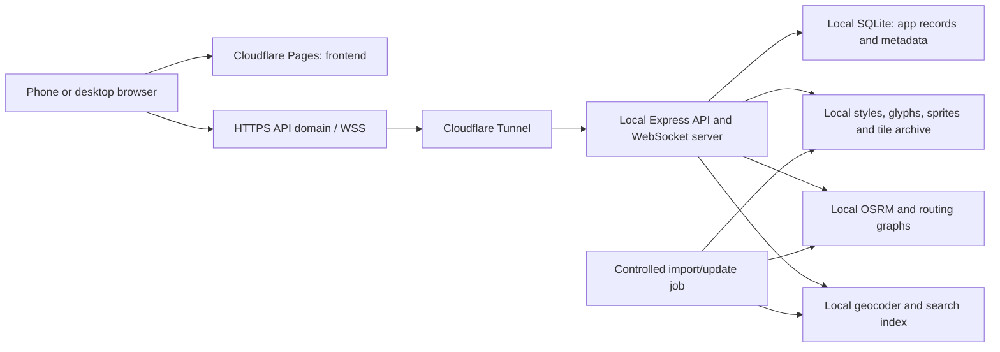

# Mapeta backend rework

Date: 2026-10-02
Status: Handoff scope for another agent. Plan the backend and delivery pipeline first; UI work follows its verification gates. Confirmed requirements are recorded below; remaining technical choices are proposals.
Role: Project Manager; repository synchronization completed as an integration task.

## Objective and boundaries

Priority confirmed on 2026-10-02: deliver incident and accident reporting in Malaysia first. Use this desktop for backend services only; Cloudflare hosts the public frontend. Plan Malaysia coverage including Peninsular Malaysia, Sabah and Sarawak. Full routing, geocoding, toll and navigation rework follows the reporting milestone rather than blocking it.

Latest direction: prioritize pipeline rework planning before UI. Reporting must use buttons and automatic location/time capture without requiring typing. Allow anonymous reporting initially; after initial deployment, require Google or email sign-in for report submission. Public map/report viewing remains accessible without sign-in. This turn changes REWORK.md only; execution belongs to another agent.

Keep application databases, mapping metadata, map assets, routing graphs, and search indexes on a local host. Publish the React frontend on a Cloudflare domain. Remove third-party mapping requests during normal operation; allow deliberate data acquisition and updates.

Confirmed on 2026-10-02: “local” means one always-on PC storing and serving the backend data. The Cloudflare frontend is publicly accessible. Visitors use their browsers; they do not install a backend. Anonymous reporting is the initial stage; post-deployment reporting requires Google or email sign-in. Favorites and telemetry visibility remain separate decisions.

“Local” means authoritative storage and processing on that host. Remote clients still receive map data through the network. Cloudflare proxies responses; browsers may cache them. Confirm whether Cloudflare edge caching is acceptable. Start with no edge caching of backend data and no storage of user data in Cloudflare databases or object storage.

Frontend availability does not guarantee backend availability: when the local PC, Internet uplink, or tunnel is down, the frontend shell may load but fresh maps, search, routing, and incidents are unavailable. Fully offline phone navigation is a separate scope.

## Repository baseline and completed task list

- [x] Reloaded global AGENTS.md; existing content already contains the supplied instructions.
- [x] Read project MEMORY.md and current implementation/configuration.
- [x] Ran git fetch origin and git pull --ff-only origin master successfully.
- [x] Confirmed remote master is cd35b367f3fefb19cac0d91f876c5f51d8d19b26.
- [x] Preserved local HEAD 11c629d, one commit ahead: thin-client architecture and fixed ingress.
- [x] Inspected database schema definitions, mapping dependencies, frontend API configuration, and deployment scripts.
- [x] Checked Repowise: CLI reports no usable index; findings below come from source inspection.
- [x] Drafted architecture, migration stages, acceptance criteria, and open decisions.
- [ ] Discuss and resolve open decisions with the user.
- [ ] Implement, validate, and deploy through separate stages after scope agreement.

No runtime rework, data download, deployment, or live service restart performed in this planning task.

## Current implementation and gaps

| Area | Current evidence | Rework needed |
| --- | --- | --- |
| Application DB | server/db/database.ts uses better-sqlite3; incidents/favorites; MAPETA_DB_PATH; WAL | Keep initially; versioned migrations, backups, ownership if multi-user |
| Routing | server/services/routeService.ts calls routing.openstreetmap.de and router.project-osrm.org | Local routing endpoint for every route and nearest-road operation |
| Search | server/services/geocodeService.ts calls Photon and Nominatim public endpoints | Local forward/reverse geocoder; remove external fallback |
| Tiles | server/services/tileService.ts serves server/data/malaysia.pmtiles | Validated archive delivery, correct Range behavior, renderer integration |
| Styles | client/src/styles/mapStyles.ts points at OpenFreeMap/CARTO; MapView and useMapTheme use these URLs | Locally owned style JSON, tiles, glyphs, sprites, attribution |
| Archive support | package.json has no PMTiles client dependency; tile route serves PMTiles only | Choose PMTiles browser integration or tile server; MBTiles is not interchangeable |
| Download helper | scripts/download-offline-map.js prints instructions; uses require in an ESM package | Implement a deliberate, verified import workflow; current helper is not a downloader |
| Other browser assets | client/index.html loads Google fonts and unpkg CSS | Bundle CSS; acquire appropriately licensed local fonts and audit asset URLs |
| Toll metadata | server/services/tollEngine.ts embeds named-road rules and fare estimates | Versioned local records with provenance, vehicle class, effective dates, estimate labeling |
| Traffic | Route processor derives delays from incidents | Preserve as estimates; local OSM data does not provide live traffic observations |
| Deployment | Pages deploy script exists; wrangler.jsonc uses an assets configuration | Select and validate one Pages deployment configuration and custom domain workflow |
| API origin | client/src/config.ts supports runtime override, VITE_API_URL, same-origin default | Set stable production API URL; prevent stale overrides from silently selecting another host |
| Security | Broad *.pages.dev CORS; API-wide 120 requests/minute; WebSocket broadcasts telemetry | Exact origins, authentication/authorization, WebSocket validation and privacy, separate tile/API limits |

These are code observations, not runtime test results. Existing docs and memory contain older claims and are not proof of deployed behavior.

## Proposed architecture

Use the existing frontend stack and backend layers. Keep specialized engines behind Express rather than exposing their ports publicly. Example hostnames are app.<owned-domain> and api.<owned-domain>; final DNS ownership and existing configuration need confirmation. The launcher mentions api.mapeta.site but that does not verify a live configured hostname.

Cloudflare Tunnel uses outbound connections from the host. Use a stable named tunnel for production. Frontend hosting uses Pages with a custom domain. See [Tunnel documentation](https://developers.cloudflare.com/cloudflare-one/networks/connectors/cloudflare-tunnel/) and [Pages custom domains](https://developers.cloudflare.com/pages/configuration/custom-domains/).

## Component decisions for discussion

| Decision | Proposed starting point | Trade-off / gate |
| --- | --- | --- |
| Application persistence | Keep SQLite | Avoid a broad database migration; reconsider PostgreSQL only for demonstrated write concurrency/spatial-query needs |
| Routing | Self-host OSRM, retaining current API shapes | Minimizes adapter changes; profile graphs and preprocessing must match required travel modes |
| OSRM algorithm | Benchmark MLD against the earlier CH preference | Current upstream recommends MLD generally; neither algorithm automatically supplies live incident-aware routing |
| Search | Evaluate a regional Photon installation first | Fits existing Photon mapping; index import/update resources and local address quality must pass a pilot |
| Geocoder alternative | Local Nominatim if Photon cannot meet requirements | Adds its own database/import operations; avoid running two geocoders without a proven need |
| Map delivery | Start with PMTiles integration to reuse existing endpoint | Validate HTTP Range, archive schema, style compatibility and local glyph/sprite completeness |
| Tile-server alternative | Local tile server for MBTiles or other required formats | Extra service, justified only if archive format or workload requires it |
| Host environment | Linux services/containers; Windows may use an agreed Linux VM/WSL environment | Do not install Docker/WSL or change host configuration in this planning task |
| Access model | Public reads; anonymous reports initially; Google/email sign-in required for reports after initial deployment | Prepare server-enforced authentication transition; keep moderation restricted at both stages |

OSRM provides routing and nearest-road APIs and documents CH/MLD preprocessing in its [official repository](https://github.com/Project-OSRM/osrm-backend). Photon supports forward/reverse search and self-hosting; index compatibility and import requirements must be checked for the pinned release in its [official repository](https://github.com/komoot/photon).

Do not promise automatic toll avoidance, hard closure exclusion, or accurate live ETAs solely by hosting OSRM. Define each behavior, select profile/customization support, and verify route geometry against representative cases. A delay added after routing does not make a closed road impassable.

## Local data ownership and lifecycle

Proposed workspace-contained data root: data/, excluded from Git and frontend builds. Production relocation requires an explicitly designated location. Separate mutable app records from reproducible mapping datasets.

| Data group | Contents |
| --- | --- |
| app | SQLite database, migration version, favorites, incidents, approved user metadata |
| sources | Original regional extracts, source URLs, licenses, timestamps and checksums |
| releases/<version>/maps | Tile archive, style JSON, glyphs, sprites and map fonts |
| releases/<version>/routing | Graphs for each supported profile, build configuration and engine version |
| releases/<version>/search | Search index or geocoder database snapshot and import version |
| metadata | Release manifest, bounds, zoom levels, schema versions, attribution and toll provenance |
| staging | Incomplete downloads and builds, never served to clients |
| backups | Consistent application DB backups and manifests; separate-device backup location remains to be agreed |

Release workflow: acquire -> checksum/license review -> build all compatible datasets -> fixture checks -> stage -> activate -> retain previous release. Activation must be safe for in-flight requests and Windows file locks; use versioned paths and a coordinated configuration switch rather than overwriting open files. Namespace caches by dataset version and invalidate mutable incident effects appropriately.

Backup application SQLite using a consistent backup mechanism, accounting for WAL. Test restoration. Do not treat a copy on the same disk as disaster recovery. Do not publish DB files, dumps, credentials, or build staging directories through static hosting.

Coverage must include routing continuity across requested borders. Rendering tiles alone do not include a usable routing graph or searchable address index. Inventory POIs, road metadata, translations, elevation/terrain, imagery and voice dependencies; include only required features with a source and license. Preserve required attribution; code licenses and data licenses are distinct.

Measure peak import RAM, graph/index size, temporary disk, active+staged+rollback storage and backup needs on the chosen regional pilot before quoting user capacity or schedules. Host specifications alone do not establish workload capacity.

## Desktop and connection measurements

Measured 2026-10-02 using Windows CIM/storage/network commands and direct HTTPS transfers from this desktop.

| Resource | Observed |
| --- | --- |
| CPU | Intel Core i9-14900; 24 cores, 32 logical processors |
| OS | Windows 11 Pro |
| RAM | 95.8 GiB usable; 57.7 GiB available at inspection |
| Disk | T-FORCE TM8FFH004T NVMe SSD; C: 3,726.1 GiB total, 1,463.2 GiB free |
| Network | Realtek Gaming 2.5GbE controller; current Ethernet link negotiated at 1 Gbps |
| Download samples | 657.7 and 720.5 Mbps; two 25,000,000-byte downloads |
| Upload samples | 164.8 and 141.2 Mbps; two 8,000,000-byte uploads, HTTP 200 |

Measurement endpoints: https://speed.cloudflare.com/__down and https://speed.cloudflare.com/__up. Synthetic payloads only; no files uploaded. These are short, single-endpoint HTTP throughput samples, not sustained ISP capacity or end-to-end tunnel benchmarks. Ethernet link speed is distinct from Internet throughput. Repeat sustained measurements and actual phone/tunnel workload tests before promising concurrent-user capacity. The server's upload serves clients; large tile responses may dominate it.

Use this existing machine as the initial backend test host. Reserve resources for Windows and current processes; do not allocate all nominal RAM or free disk to imports. The backend-only target does not authorize disabling other software or changing OS settings.

## First milestone: Malaysia incident and accident reporting

Confirmed reporting interaction: buttons only, with no required title, description, address, or other typed input. Select Accident or another predefined incident category, capture GPS coordinates and accuracy, then confirm submission. Server assigns receipt time; use predefined time choices only if an earlier occurrence must be supported. Proposed fallback for denied/inaccurate GPS: choose a map pin and confirm, without typing. Generate display text from category metadata. Keep confirmation/resolution actions button-based and permission-controlled.

Keep reports in local SQLite and mapping assets on this PC; show active reports publicly and synchronize changes with reconnect reconciliation. Routing/search services are not prerequisites for reporting. Design the API/data contract first; defer UI implementation until pipeline and backend gates pass.

Proposed backend work: validate coordinates against Malaysia coverage (a rectangular bounding box alone includes other countries), accept a bounded category enum and location rather than required free text, assign server timestamps and stable IDs, prevent retry duplicates, support viewport/time-filtered pagination, and maintain a report lifecycle with moderation history. Treat nearby reports as possible duplicates rather than silently merging separate accidents. Anonymous session identifiers can assist rate limits and retries but do not prove one human/one vote. Protect moderation endpoints and minimize collection/exposure of reporter location and identity.

Proposed public launch gate: exact CORS, HTTP/WebSocket validation, submission limits, moderation/removal controls and a defined retention policy. Public display must distinguish community reports from verified information. Start without photo/video attachments to keep storage, privacy and bandwidth scope small; attachments remain a discussion option.

Reporting acceptance: two browser sessions submit and receive an accident report; retry causes no duplicate; reconnect recovers missed changes; report survives backend restart; resolved/expired reports leave the active view; invalid/out-of-coverage submissions and unauthorized moderation are rejected. Validate map pins in Peninsular Malaysia, Sabah and Sarawak. Measure submission latency and fan-out load through the actual tunnel against agreed targets.

Interaction acceptance: complete a report without opening the keyboard, including the GPS-denied fallback. Authentication acceptance: initial anonymous submission succeeds; after the post-deployment authentication switch, unsigned submissions fail server-side while public reads remain available. Old clients must not bypass the switch.

## Pipeline-first handoff to the implementing agent

Immediate assignment: inspect existing CI, scripts, configuration and contracts; refine this plan into ordered, reviewable backend/pipeline changes before touching UI. Preserve the current stack and local commit. Do not assume historical test counts are current. Do not deploy or restart the live backend/tunnel without explicit instruction.

Plan and then deliver these pipeline workstreams in order:

1. **Baseline and contracts:** inspect GitHub workflows, package scripts and isolated test setup. Define the minimal report payload (category, coordinates, accuracy when available, idempotency key), generated display fields, lifecycle states and errors. Record existing API compatibility and a rollback baseline.
2. **Configuration and data safety:** validate environment configuration at startup; separate local/staging/production paths; version schema migrations; exclude DBs, archives and secrets from Git/build artifacts. Test migrations and restore with fixtures before production data is touched.
3. **CI quality gates:** plan clean dependency install, lint, typecheck, isolated unit/integration tests and separate frontend/backend builds. Test reporting contracts, lifecycle, invalid input, retry deduplication, anonymous access and future authenticated enforcement. PR checks must not access production data, download full map datasets or restart this PC.
4. **Artifact pipeline:** produce traceable frontend and backend artifacts from the same commit with a compatible API/schema version. Keep map datasets versioned separately. Validate Pages output/configuration and ensure frontend artifacts contain neither backend data nor secrets.
5. **Local backend delivery:** specify staging validation, consistent DB backup, migration sequence, readiness checks and rollback. Distinguish code rollback from schema rollback; prefer compatible migrations. Define recovery from interrupted releases and failed readiness without discarding reports.
6. **Data acquisition pipeline:** source/checksum/license manifest -> staging -> validation -> activation -> retained previous version. First deliver local Malaysia basemap assets; defer routing/search imports. Keep imports separate from request handling and routine CI.
7. **Public API ingress:** prepare stable tunnel configuration, exact allowed origins, trusted proxy handling, HTTP/WS input limits and separate read/write/tile budgets. Verify with integration/load tests before UI integration. Keep moderation authentication independent from anonymous reporting.
8. **Release evidence and operations:** record test/build results, dataset versions, measured limits, backup restore evidence, failure/reconnect checks, logs with sensitive fields redacted, and operator rollback steps. Only then integrate the button-only UI and validate on a phone.

Pipeline acceptance: a fresh checkout can produce reproducible artifacts and run isolated gates; report APIs can be exercised without UI; deployment/rollback instructions are concrete; no pipeline step silently modifies the live database or restarts production. Exact workflow changes must follow inspection of the current workflows rather than replacing them wholesale.

Required handoff artifacts: update this REWORK.md with decisions and unresolved items; provide the actual task list, implementation plan, verification results and walkthrough for each completed stage. Developer hands off to Integrator and Tester; no self-declared production sign-off.

## Affected files for agent handoff

Paths below are repository-relative to `C:/Users/PC/Mapeta`. Existing paths were verified on 2026-10-02. This is a planning impact map, not a claim that these files have been changed. Read each file before editing; change only what its phase requires. Proposed paths are suggestions, not files already present or a requirement to create every module.

### Pipeline and backend first — existing files

| Files | Intended impact / verification |
| --- | --- |
| `.github/workflows/ci.yml`, `.github/workflows/README.md` | Inspect and refine clean-install, lint, typecheck, isolated tests, build and artifact gates; document release boundaries |
| `package.json`, `package-lock.json`, `.husky/pre-commit` | Align verified scripts/dependencies and local checks with CI; change lockfile only for actual dependency changes |
| `tsconfig.json`, `tsconfig.test.json`, `server/tsconfig.json`, `eslint.config.js` | Inspect coverage of backend/tests and enforce existing conventions; edit only for demonstrated gaps |
| `.gitignore` | Review data/secret/artifact exclusions and existing catch-all rule that ignores REWORK.md; do not broadly unignore data |
| `server/__tests__/helpers/setupEnv.ts`, `server/__tests__/helpers/testDb.ts`, `server/__tests__/backendMvvm.test.ts` | Preserve test DB isolation; extend baseline contract/lifecycle verification |
| `server/db/database.ts` | Versioned migrations, reporting fields/indexes, configured data path and backup-safe lifecycle |
| `server/models/types.ts`, `server/models/incidentModel.ts` | Category/location contracts, generated text compatibility, report state, persistence and bounded queries |
| `server/services/incidentService.ts` | Validation, lifecycle, retry deduplication, expiry and permission boundaries |
| `server/controllers/incidentController.ts`, `server/routes/incidentRoutes.ts`, `server/routes/index.ts` | Button-compatible payload, status/error contracts and restricted moderation routes |
| `server/ws/incidentSocket.ts` | Validate messages, control fan-out, enforce permissions, support reconnect reconciliation and restrict telemetry |
| `server/app.ts`, `server/index.ts`, `server/controllers/healthController.ts` | Startup validation, readiness, CORS, trusted proxy handling, request budgets and service shutdown |
| `server/middleware/errorHandler.ts`, `server/middleware/asyncHandler.ts` | Inspect error propagation; extend only where new report/configuration errors require it |
| `server/services/tileService.ts`, `server/controllers/tileController.ts`, `server/routes/tileRoutes.ts` | Versioned local assets, archive validation, correct Range/HEAD/errors and streaming behavior |
| `scripts/download-offline-map.js` | Replace instruction-only helper with the agreed staged import/validation process; correct ESM mismatch |
| `wrangler.jsonc`, `scripts/deploy-pages.ps1`, `client/public/_redirects`, `vite.config.ts` | Validate frontend build output and Pages routing/configuration; separate build and authorized deployment |
| `server/launcher.js`, `start-mapeta.cmd`, `start-mapeta.bat` | Inspect current startup/tunnel behavior; design backend-only supervision and explicit release/restart steps |
| `README.md`, `REWORK.md` | Operator walkthrough, restore/rollback instructions, confirmed scope and completion evidence |

### Pipeline and backend first — proposed additions

| Proposed files | Purpose / creation gate |
| --- | --- |
| `.env.example`, `server/config.ts` | Document and validate non-secret configuration; actual credentials stay outside source control |
| `server/db/migrations/001_reporting.sql`, `server/db/migrate.ts` | Example migration layout; finalize numbering and baseline strategy after inspecting the existing DB initializer |
| `server/__tests__/incidentReporting.test.ts`, `server/__tests__/incidentSocket.test.ts`, `server/__tests__/tileDelivery.test.ts`, `server/__tests__/migrations.test.ts` | Regression coverage for contracts, synchronization, archive delivery and migration/rollback safety |
| `scripts/backup-db.ts`, `scripts/restore-db.ts`, `scripts/validate-map-release.ts` | Consistent backup/restore and staged dataset validation; prefer existing helpers if discovered |
| `data/metadata/manifest.json` | Runtime dataset provenance/version/coverage manifest; generated local data, excluded from frontend artifacts and Git |
| `deploy/cloudflared.example.yml`, `deploy/backend.example.env` | Sanitized ingress/backend configuration examples; no live tunnel token or deployment action |

Do not introduce a second CI/release workflow merely for naming consistency. Extend existing scripts first; add a release workflow only if the reviewed delivery process needs one.

### UI integration later — existing files

| Files | Intended impact after pipeline/backend gates |
| --- | --- |
| `client/src/models/IncidentModel.ts`, `client/src/models/IncidentService.ts`, `client/src/viewmodels/useIncidentViewModel.ts` | Match report contracts; preserve retry identity; expose structured categories and lifecycle actions |
| `client/src/components/Incidents/ReportModal.tsx`, `client/src/components/Incidents/IncidentDetails.tsx` | Remove required typing; use category/confirmation buttons and permission-aware actions |
| `client/src/hooks/useGeolocation.ts`, `client/src/components/Map/hooks/useMapInteractions.ts` | GPS accuracy/permission states and manual pin fallback without typed address |
| `client/src/hooks/useIncidentSocket.ts`, `client/src/components/Map/hooks/useIncidentMarkers.ts`, `client/src/components/UI/ConnectionStatus.tsx` | Reconcile reports after reconnect and display current state reliably |
| `client/src/config.ts`, `client/src/__tests__/config.test.ts`, `client/src/components/UI/BackendSettings.tsx` | Stable production API origin, safe override handling and future authenticated session requests |
| `client/src/styles/mapStyles.ts`, `client/src/components/Map/MapView.tsx`, `client/src/components/Map/hooks/useMapTheme.ts` | Connect local styles/archive protocol and verify compatible day/night assets |
| `client/index.html`, `client/src/main.tsx`, `client/src/index.css` | Bundle CSS/fonts and remove external rendering dependencies where referenced |
| `client/sw.ts`, `client/manifest.json` | Inspect cache/version behavior; avoid presenting stale reports as live or promising unsupported offline navigation |
| `client/src/views/MainNavigationView.tsx`, `client/src/App.tsx` | Inspect reporting entry points; edit only if button flow or later authentication requires wiring |

Proposed UI regression file: `client/src/__tests__/IncidentService.test.ts`. Browser-level no-keyboard/GPS-denied/reconnect checks need an agreed test runner; do not assume one is installed.

### Authentication after deployment — conditional files

Revisit `server/app.ts`, `server/routes/index.ts`, `server/routes/incidentRoutes.ts`, `server/services/incidentService.ts`, `server/ws/incidentSocket.ts`, `server/db/database.ts`, `client/src/config.ts` and reporting UI integration points. Proposed additions: `server/middleware/requireReporter.ts`, `server/routes/authRoutes.ts`, `server/services/authService.ts`, `server/__tests__/reportAuth.test.ts` and a separately numbered account/session migration. Final provider integration and UI filenames depend on the agreed Google/email implementation. Test anonymous-to-authenticated cutover and old-client rejection.

### Deferred or inspect-only

- `server/services/routeService.ts`, `server/services/geocodeService.ts`, `server/services/tollEngine.ts`, `server/services/routeProcessor.ts`, `server/models/navigation.ts`: later routing/search/toll scope; do not make these prerequisites for reporting.
- `client/src/models/RouteService.ts`, `client/src/models/GeocodeService.ts`, `client/src/viewmodels/useNavigationViewModel.ts`: later navigation integration.
- `.github/workflows/apk.yml`, `scripts/build-apk.js`, `scripts/setup-android.ps1`: inspect shared-script compatibility if affected; Android packaging is outside this reporting rework.
- Runtime SQLite files, full mapping datasets and local credentials: migration/import inputs, never ordinary source edits or frontend artifacts.

## Post-deployment Google/email authentication stage

Sequence: deploy the anonymous reporting milestone first, then implement and validate Google/email sign-in and enable required authentication for report writes. The exact cutover date is unresolved; it must be an explicit release step, not silently assumed to happen with the initial deployment.

Prepare an identity boundary in the report service now, with nullable reporter ownership for historical anonymous reports. Preserve those reports without inventing accounts or retroactively assigning ownership. Server configuration controls whether writes require a validated session; browser flags cannot grant permission. Keep public report responses free of private identity details.

Google and email authentication method/provider selection belongs to the follow-up stage. Email magic link versus password remains open; button-only reporting does not prohibit email entry during sign-in. Select session storage, secure cookies/CSRF protection, callback origins, account-linking rules and email delivery only after reviewing that integration. Never put client secrets or mail credentials into the frontend. Permit restricted administration throughout both stages.

## API and frontend changes

Preserve existing route/geocode/favorites/incidents response shapes where practical. Inject configured local upstream URLs into services; use timeouts, bounded concurrency, explicit errors and no silent public-provider fallback. Separate process liveness from readiness of maps, routing and search.

Add a public configuration/manifest response exposing only safe fields: supported region, dataset version, capabilities and map style URLs. Use one API origin resolver for HTTP, WebSocket and map resources. Keep frontend state and map rendering in the browser; map data and business processing remain on the local host.

For PMTiles, connect the selected client protocol explicitly and test 200/206/416, suffix/open-ended/malformed ranges, HEAD, content length, CORS response-header exposure, cancellation and stream errors. Current range implementation needs correction before production use. Apply separate request budgets for tile bursts and expensive routing requests.

Replace broad CORS with exact configured frontend origins. Implement real authentication if private access is selected; CORS is not authentication. Validate WebSocket origins, sessions, message types, sizes and rates; restrict telemetry distribution. Validate trusted proxy configuration so clients cannot spoof rate-limit identities. Test cross-origin login/preflight and WSS reconnect behavior through the actual tunnel.

Frontend must explain backend outage, unavailable region, missing dataset and stale data. An installed PWA is not automatically offline-capable. Device speech voices may have network dependencies: verify local voice availability or define a fallback.

## Implementation plan and verification gates

| Phase | Work | Acceptance / verification |
| --- | --- | --- |
| 0. Pipeline planning | Inspect existing workflows; refine the ordered handoff above; define contracts and release boundaries | Reviewable pipeline plan before UI changes |
| 1. Pipeline foundation | Implement isolated CI gates, configuration validation, artifact separation and migration/rollback checks | Clean-checkout build/test evidence; production data untouched |
| 2. Reporting backend | Implement button-compatible payload, lifecycle, local persistence, anonymous writes and protected moderation | API-only tests cover submission, retries, expiry, resolution, restart and reconnect |
| 3. Local map/data pipeline | Prepare versioned Malaysia basemap assets and validate delivery | Region, checksums, style dependencies, Range handling and rollback verified |
| 4. Ingress and operations | Stage named tunnel/Pages configuration; verify CORS/WSS, abuse limits, backup/restore and readiness | Integration and load evidence before UI work |
| 5. Button-only UI | Integrate the verified reporting API and local maps | No required typing; GPS fallback; live reporting works on mobile data |
| 6. Initial deployment | Release anonymous reporting with public reads and restricted moderation | Tester sign-off and explicit deployment/restart instruction |
| 7. Authentication follow-up | Add Google/email sign-in; switch report writes to required authentication | Unsigned writes rejected; public reads and historical reports retained |
| 8. Navigation follow-up | Local routing/search, toll metadata and navigation behavior | Separate scoped validation; reporting milestone remains independent |

Developers implement each stage; Integrator verifies service/configuration contracts; Tester validates results. This needs Tester sign-off before merge. Do not replace source inspection with claims that tests passed.

## Walkthrough and final acceptance scenario

1. Start the local services with a validated dataset release. Readiness identifies that release and supported coverage.
2. Open the Cloudflare frontend on a phone over mobile data. Authenticate if required.
3. Pan/zoom and switch day/night style; inspect labels, icons and attribution.
4. For the first milestone, place a pin and submit an accident or incident report; confirm it appears on a second device. Test retry, resolve, expiry and reconnect behavior.
5. Verify restart persistence and unauthorized moderation rejection. For the later navigation milestone, additionally test search, reverse geocoding, supported route modes, navigation and favorites.
6. Block third-party mapping providers while retaining Cloudflare connectivity. Repeat with cold browser/server caches and collect request logs.
7. Stop a backend dependency. Confirm a clear degraded state and bounded retries. Restore it and verify recovery.
8. Install a staged dataset, simulate a failed update, roll back, and restore an application DB backup.

Success: agreed features run using locally stored mapping resources and local computation, frontend is served from the selected Cloudflare domain, user records survive migration, and remote access works within measured capacity. No claim of all-country coverage, real-time traffic accuracy, or fully offline phone operation without separate validation.

## Open decisions

1. Confirmed: one always-on PC hosts the backend and mapping resources; frontend is public.
2. Confirmed priority: Malaysia incident/accident reporting. Broader countries and full navigation remain later scope.
3. Desktop and current connection measured above. Expected concurrent users, report volume and availability targets remain unresolved.
4. Confirmed: anonymous reporting initially; Google/email sign-in required after deployment. Decide email method, provider and cutover timing; favorites ownership remains deferred.
5. Required travel modes; toll avoidance, hard road closures, traffic estimates and voice requirements?
6. Dataset refresh frequency and acceptable staleness? Expected outage/recovery targets?
7. Domain and Cloudflare account already available? Is proxying and browser caching acceptable; may public map tiles use edge caching?
8. Is offline navigation on the phone required, or only independence from third-party mapping providers?

## Sources and verification record

Local sources: package.json, wrangler.jsonc, README.md, MEMORY.md, server/app.ts, server/db/database.ts, server/routes/index.ts, server/services/{tileService,routeService,geocodeService,tollEngine,routeProcessor}.ts, server/ws/incidentSocket.ts, client/src/config.ts, client/src/styles/mapStyles.ts, MapView.tsx, useMapTheme.ts, client/index.html and deployment/download scripts.

External sources consulted on 2026-10-02: official Cloudflare Pages/Tunnel documentation and OSRM/Photon repositories linked above. Tools: local PowerShell/Git/rg, Repowise CLI availability check, web documentation lookup. No database contents or credentials read. Only Git synchronization and document changes were executed; implementation acceptance checks remain future work.
